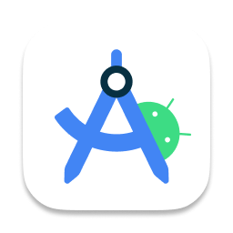
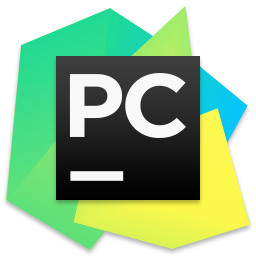

### Hi there 👋  I'm ListenerGao

 

  <a href="https://github.com/ListenerGao" class="rich-diff-level-one">
    
    <!-- &hide=issues
    
    -->
  </a>

  
  &emsp;
  
  &emsp;
  
  &emsp;
  
  &emsp;
  <!--
  
  &emsp;
  
  
  &emsp;
  
  &emsp;
  -->
    
  <strong>Check out my work below!</strong>
    
  <!--参考 https://github.com/STRRL/serverless-github-badges -->
  
  
  
  
  

<h2></h2>

 &nbsp;&nbsp;&nbsp;&nbsp;

<!-- stackoverflow profile
-->
 
**Languages and Frameworks**

<code></code>
<code></code>
<code></code>
<code></code>
<code></code>
<code></code>
<code></code>
<code></code>
<code></code>
<code></code>
<code></code>

**Tools and Environments**

<code></code>
<code></code>
<code></code>
 

<!--
**ListenerGao/ListenerGao** is a ✨ _special_ ✨ repository because its `README.md` (this file) appears on your GitHub profile.

Here are some ideas to get you started:

- 🔭 I’m currently working on ...
- 🌱 I’m currently learning ...
- 👯 I’m looking to collaborate on ...
- 🤔 I’m looking for help with ...
- 💬 Ask me about ...
- 📫 How to reach me: ...
- 😄 Pronouns: ...
- ⚡ Fun fact: ...
-->
